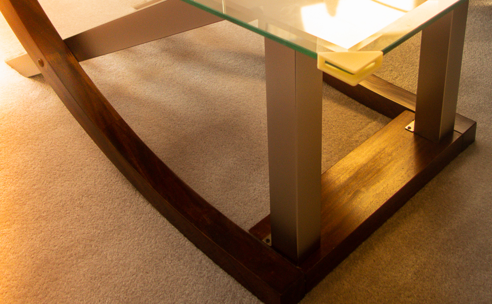

# Table Corners

Do you have a glass table where the corners are sharp and need protecting?
This project provides 3D printed corners for that table.  The
table corners can be affixed using
[Therm O Web Zots](https://www.thermowebonline.com/c/crafts-scrapbooking_adhesive-dots-lines).

Edit the table-corners.ipt part file to create a similar part.  The STEP file
can be used to directly create the part on a 3D printer.

## Rendered 3D View

## Built With

* Autodesk Inventor

## Contributing

Please contact the author to contribute or to suggest modified versions if you want your own table corner.

## Authors

* **Nicholas J. Kinar** - *Initial work* - 3D model

## License

This project is licensed under the MIT License - see the [LICENSE.md](LICENSE.md) file for details

## Acknowledgments

* Autodesk for the Inventor Professional software license for education
* Full Deck Visuals (Saskatoon, Saskatchewan, Canada) for the image
